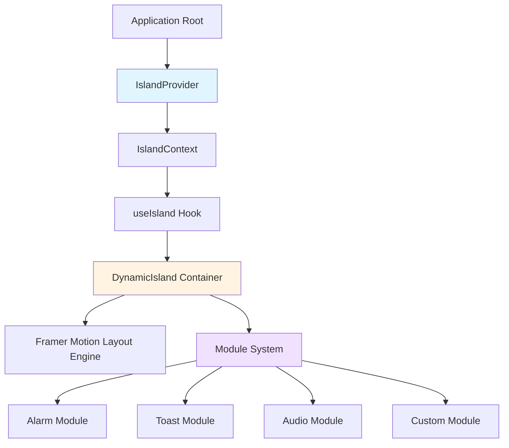
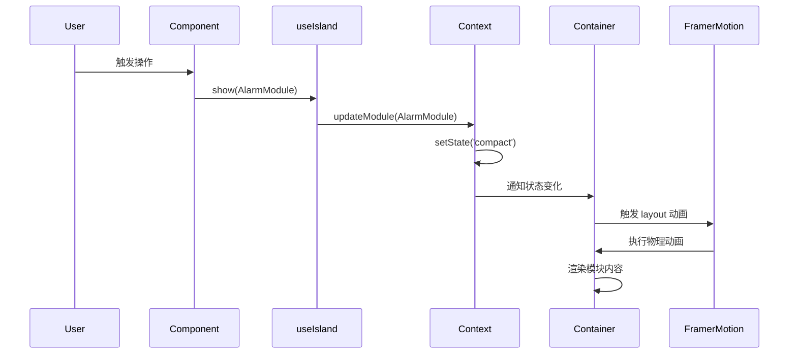

# Design Document: Dynamic Island Component Library

## Overview

本设计文档描述了一个基于 React 18 和 Framer Motion 的网页端灵动岛 (Dynamic Island) 组件库的技术实现方案。该组件库提供了一个高度可定制、支持插拔的交互式 UI 容器，能够在不同物理状态之间流畅切换，并通过模块化系统展示各种内容。

### 核心设计目标

1. **流畅的物理动画**: 使用 Framer Motion 的 layout 属性和弹簧物理引擎，实现自然的形态变化动画
2. **模块化架构**: 容器与内容完全解耦，支持开发者自定义模块
3. **简洁的 API**: 通过 React Context 和 Hook 提供直观的控制接口
4. **类型安全**: 完整的 TypeScript 类型定义
5. **高性能**: 利用 GPU 加速和 React 优化技术

### 技术栈

- **React 18**: 核心框架，利用并发特性和自动批处理
- **Framer Motion**: 动画引擎，提供声明式动画和布局动画
- **TypeScript**: 类型系统，确保类型安全
- **CSS-in-JS**: 使用 styled-components 或内联样式实现动态样式

## Architecture

### 系统架构图



### 架构层次

#### 1. Context Layer (上下文层)

**IslandProvider** 是整个系统的状态管理中心，负责：
- 维护当前激活的模块引用
- 管理灵动岛的物理状态 (default/compact/expanded)
- 提供状态更新方法给消费组件
- 处理模块切换和状态转换逻辑

#### 2. API Layer (接口层)

**useIsland Hook** 提供简洁的控制接口：
- `show(module, config)`: 激活指定模块
- `hide()`: 隐藏当前模块
- `state`: 获取当前状态
- 内部处理防抖和状态验证

#### 3. Presentation Layer (展示层)

**DynamicIsland Container** 负责视觉呈现：
- 响应状态变化，触发布局动画
- 渲染当前激活的模块内容
- 管理 AnimatePresence 实现内容过渡
- 应用物理动画参数

#### 4. Module Layer (模块层)

**Module System** 提供可插拔的内容系统：
- 标准化的模块接口 (ModuleProps)
- 内置模块实现 (Alarm, Toast, Audio)
- 支持自定义模块扩展

### 数据流



### 关键设计决策

1. **为什么使用 Context API 而非状态管理库？**
   - 灵动岛是单例组件，不需要复杂的状态管理
   - Context API 足够轻量，减少依赖
   - 简化开发者的学习曲线

2. **为什么选择 Framer Motion 的 layout 属性？**
   - 自动处理布局变化的动画插值
   - 无需手动计算中间状态
   - 支持复杂的弹簧物理引擎
   - 自动优化性能（使用 transform）

3. **为什么容器与内容解耦？**
   - 提高可扩展性，开发者可自定义模块
   - 降低耦合度，便于测试
   - 符合开闭原则（对扩展开放，对修改关闭）

## Components and Interfaces

### 核心组件

#### 1. IslandProvider

```typescript
interface IslandProviderProps {
  children: React.ReactNode;
  defaultState?: IslandState;
}

const IslandProvider: React.FC<IslandProviderProps>
```

**职责**:
- 初始化全局状态
- 提供 Context 给子组件
- 管理模块生命周期

**实现要点**:
- 使用 `useState` 管理 `activeModule` 和 `currentState`
- 使用 `useCallback` 优化状态更新函数
- 实现防抖逻辑，避免快速切换导致的动画冲突

#### 2. DynamicIsland

```typescript
interface DynamicIslandProps {
  className?: string;
  style?: React.CSSProperties;
}

const DynamicIsland: React.FC<DynamicIslandProps>
```

**职责**:
- 渲染灵动岛容器
- 应用物理动画
- 管理内容过渡

**实现要点**:
- 使用 `motion.div` 作为根元素
- 应用 `layout` 属性启用自动布局动画
- 配置 `transition` 为弹簧物理 `{ type: 'spring', stiffness: 300, damping: 20 }`
- 使用 `AnimatePresence` 包裹模块内容，配置 `mode="wait"`
- 根据 `currentState` 动态计算样式（宽度、高度、圆角）

#### 3. useIsland Hook

```typescript
interface UseIslandReturn {
  show: (module: React.ComponentType<ModuleProps>, config?: ModuleConfig) => void;
  hide: () => void;
  state: IslandState;
  isVisible: boolean;
}

function useIsland(): UseIslandReturn
```

**职责**:
- 提供命令式 API
- 访问全局状态
- 处理模块激活逻辑

**实现要点**:
- 使用 `useContext(IslandContext)` 获取状态和方法
- `show` 方法接受模块组件和可选配置，调用 Context 的更新方法
- `hide` 方法触发隐藏动画，300ms 后重置状态
- 返回当前状态供组件响应式使用

### 模块接口

#### ModuleProps

```typescript
interface ModuleProps {
  state: IslandState;
  onDismiss: () => void;
  onStateChange?: (newState: IslandState) => void;
}
```

所有模块必须接受这些标准 props：
- `state`: 当前灵动岛状态，模块根据此渲染不同内容
- `onDismiss`: 关闭回调，模块可主动触发隐藏
- `onStateChange`: 可选的状态变更请求，如从 compact 切换到 expanded

### 内置模块

#### 1. AlarmModule

```typescript
interface AlarmModuleProps extends ModuleProps {
  duration: number; // 倒计时秒数
  onComplete?: () => void;
  onSnooze?: (additionalMinutes: number) => void;
}

const AlarmModule: React.FC<AlarmModuleProps>
```

**状态渲染**:
- **compact**: 显示 "⏱️ MM:SS" 格式的倒计时
- **expanded**: 显示大号数字时间 + "停止" 和 "稍后提醒" 按钮

**交互逻辑**:
- 使用 `useEffect` + `setInterval` 实现倒计时
- 倒计时归零时调用 `onComplete`
- "停止" 按钮调用 `onDismiss`
- "稍后提醒" 按钮增加 5 分钟并调用 `onStateChange('compact')`

#### 2. ToastModule

```typescript
interface ToastModuleProps extends ModuleProps {
  message: string;
  variant?: 'success' | 'error' | 'warning' | 'info';
  duration?: number; // 默认 3000ms
  icon?: React.ReactNode;
}

const ToastModule: React.FC<ToastModuleProps>
```

**状态渲染**:
- **compact**: 显示图标 + 文本（最多 30 字符）
- **expanded**: 不使用（Toast 仅在 compact 状态）

**交互逻辑**:
- 使用 `useEffect` 设置自动隐藏定时器
- 根据 `variant` 选择对应图标和颜色
- 定时器到期后调用 `onDismiss`

#### 3. AudioModule

```typescript
interface AudioModuleProps extends ModuleProps {
  title: string;
  artist: string;
  albumCover: string;
  isPlaying: boolean;
  progress: number; // 0-1
  onPlayPause: () => void;
  onSeek: (position: number) => void;
  onPrevious?: () => void;
  onNext?: () => void;
}

const AudioModule: React.FC<AudioModuleProps>
```

**状态渲染**:
- **compact**: 左侧专辑封面 + 右侧波形动画
- **expanded**: 专辑封面 + 歌曲信息 + 进度条 + 控制按钮

**交互逻辑**:
- 波形动画使用 Framer Motion 的 `animate` 属性，根据 `isPlaying` 控制
- 进度条支持拖拽，调用 `onSeek` 更新播放位置
- 播放/暂停按钮调用 `onPlayPause`

## Data Models

### 类型定义

#### IslandState

```typescript
type IslandState = 'default' | 'compact' | 'expanded';
```

三种物理状态对应的尺寸规格：
- **default**: 150px × 36px, border-radius: 24px
- **compact**: 200px × 40px, border-radius: 24px
- **expanded**: 360px × 160px, border-radius: 40px

#### IslandContextType

```typescript
interface IslandContextType {
  activeModule: React.ComponentType<ModuleProps> | null;
  moduleProps: Record<string, any> | null;
  currentState: IslandState;
  updateModule: (
    module: React.ComponentType<ModuleProps> | null,
    props?: Record<string, any>,
    targetState?: IslandState
  ) => void;
  setState: (state: IslandState) => void;
}
```

**字段说明**:
- `activeModule`: 当前激活的模块组件类型
- `moduleProps`: 传递给模块的额外 props
- `currentState`: 当前物理状态
- `updateModule`: 更新模块和状态的方法
- `setState`: 直接设置状态的方法

#### ModuleConfig

```typescript
interface ModuleConfig {
  initialState?: IslandState;
  props?: Record<string, any>;
  dismissOnClickOutside?: boolean;
}
```

**字段说明**:
- `initialState`: 模块激活时的初始状态（默认 'compact'）
- `props`: 传递给模块的自定义 props
- `dismissOnClickOutside`: 是否点击外部区域关闭（默认 false）

### 状态转换规则

```typescript
type StateTransition = {
  from: IslandState;
  to: IslandState;
  duration: number; // 由弹簧物理自动计算
};
```

**允许的转换**:
- default ↔ compact
- compact ↔ expanded
- default → expanded (跳过 compact)
- expanded → default (跳过 compact)

**转换触发条件**:
1. 模块激活时：default → initialState
2. 模块内部请求：通过 `onStateChange` 回调
3. 模块关闭时：currentState → default

### 动画配置

```typescript
interface AnimationConfig {
  layout: {
    type: 'spring';
    stiffness: 300;
    damping: 20;
  };
  opacity: {
    duration: 0.2;
  };
  presence: {
    mode: 'wait';
  };
}
```

**参数说明**:
- **stiffness: 300**: 弹簧刚度，控制动画速度
- **damping: 20**: 阻尼系数，控制回弹效果
- **opacity duration: 0.2s**: 内容淡入淡出时间，快于布局动画
- **mode: 'wait'**: 等待退出动画完成后再进入新内容


## Correctness Properties

*属性 (Property) 是指在系统所有有效执行中都应该成立的特征或行为——本质上是关于系统应该做什么的形式化陈述。属性作为人类可读规范和机器可验证正确性保证之间的桥梁。*

### Property Reflection

在分析所有验收标准后，我识别出以下冗余情况：

1. **动画配置重复**: 标准 4.4 和 8.3 都要求 opacity 动画快于 layout 动画，可以合并为一个属性
2. **AnimatePresence 使用重复**: 标准 4.2 和 8.4 都要求使用 AnimatePresence，这是同一个实现细节
3. **API 接口检查**: 标准 3.1、3.2、3.3 都是检查 useIsland Hook 的接口，可以合并为一个示例测试
4. **类型导出检查**: 标准 9.1-9.5 都是检查类型导出，可以合并为一个示例测试

经过反思，我将把相关属性合并，确保每个属性提供独特的验证价值。

### Property 1: 状态尺寸规格

*对于任何* IslandState 值（default、compact、expanded），渲染后的 DynamicIsland 组件的宽度、高度和圆角半径应该精确匹配该状态的规格定义。

**Validates: Requirements 1.1**

### Property 2: 弹簧物理配置

*对于任何* 状态转换，DynamicIsland 的 layout 动画配置应该使用 spring 类型，且 stiffness 为 300，damping 为 20。

**Validates: Requirements 1.2, 8.2**

### Property 3: 居中位置保持

*对于任何* 状态转换（从任意状态到任意状态），DynamicIsland 的水平中心位置在转换前后应该保持不变。

**Validates: Requirements 1.4**

### Property 4: 动画时长范围

*对于任何* 状态转换，由弹簧物理驱动的动画完成时间应该在 0.3 到 0.6 秒之间。

**Validates: Requirements 1.5**

### Property 5: 模块引用维护

*对于任何* 模块组件，当通过 IslandProvider 激活该模块时，Provider 的 activeModule 状态应该正确引用该模块组件。

**Validates: Requirements 2.2**

### Property 6: 状态值维护

*对于任何* IslandState 值，当通过 IslandProvider 设置状态时，Provider 的 currentState 应该正确反映该值。

**Validates: Requirements 2.3**

### Property 7: 模块激活触发状态转换

*对于任何* 模块和目标状态，当调用 updateModule 激活模块时，IslandProvider 应该同时更新 activeModule 和 currentState。

**Validates: Requirements 2.4**

### Property 8: 关闭重置时间

*对于任何* 激活的模块，当调用 dismiss 方法时，IslandProvider 应该在 300ms 内将 currentState 重置为 'default'，并清空 activeModule。

**Validates: Requirements 2.5**

### Property 9: Hook 激活模块

*对于任何* 模块组件和配置，当调用 useIsland 返回的 show 方法时，该模块应该被激活且状态应该转换到配置指定的 initialState（默认 'compact'）。

**Validates: Requirements 3.4**

### Property 10: Hook 隐藏模块

*对于任何* 激活的模块，当调用 useIsland 返回的 hide 方法时，currentState 应该重置为 'default'，且 activeModule 应该被清空。

**Validates: Requirements 3.5**

### Property 11: 模块渲染解耦

*对于任何* 符合 ModuleProps 接口的自定义模块组件，DynamicIsland 应该能够成功渲染该模块而不依赖特定的模块实现。

**Validates: Requirements 4.1, 4.5**

### Property 12: 模块状态配置

*对于任何* 模块配置中指定的 initialState，激活该模块时，DynamicIsland 应该转换到该状态。

**Validates: Requirements 4.3**

### Property 13: 内容动画时序

*对于任何* 模块内容变化，opacity 过渡的持续时间（0.2s）应该小于 layout 动画的持续时间（由弹簧物理决定，约 0.3-0.6s）。

**Validates: Requirements 4.4, 8.3**

### Property 14: Alarm 模块 compact 状态渲染

*对于任何* 倒计时秒数，当 AlarmModule 处于 compact 状态时，渲染输出应该包含格式为 "⏱️ MM:SS" 的文本，其中 MM 和 SS 正确反映剩余时间。

**Validates: Requirements 5.1**

### Property 15: Alarm 模块 expanded 状态渲染

*对于任何* 倒计时秒数，当 AlarmModule 处于 expanded 状态时，渲染输出应该包含数字时间显示、"停止" 按钮和 "稍后提醒" 按钮。

**Validates: Requirements 5.2**

### Property 16: Alarm 倒计时归零回调

*对于任何* AlarmModule 实例，当倒计时从正数减少到零时，onComplete 回调应该被调用恰好一次。

**Validates: Requirements 5.3**

### Property 17: Alarm 停止按钮行为

*对于任何* AlarmModule 实例，当点击 "停止" 按钮时，onDismiss 回调应该被调用，且倒计时定时器应该停止。

**Validates: Requirements 5.4**

### Property 18: Alarm 稍后提醒行为

*对于任何* AlarmModule 实例，当点击 "稍后提醒" 按钮时，倒计时应该增加 300 秒（5 分钟），且 onStateChange 应该被调用并传入 'compact'。

**Validates: Requirements 5.5**

### Property 19: Toast 初始状态

*对于任何* ToastModule 配置，当激活 ToastModule 时，目标状态应该为 'compact'。

**Validates: Requirements 6.1**

### Property 20: Toast 内容渲染

*对于任何* 消息文本和变体类型，ToastModule 的渲染输出应该包含对应变体的图标和文本内容（截断到最多 30 字符）。

**Validates: Requirements 6.2**

### Property 21: Toast 自动关闭

*对于任何* ToastModule 实例，显示后应该在 3000ms（±100ms 容差）内自动调用 onDismiss。

**Validates: Requirements 6.3, 6.4**

### Property 22: Toast 变体图标

*对于任何* 变体类型（success、error、warning、info），ToastModule 应该渲染该变体对应的唯一图标。

**Validates: Requirements 6.5**

### Property 23: Audio 模块 compact 状态布局

*对于任何* AudioModule props，当处于 compact 状态时，渲染输出应该在左侧包含专辑封面元素，在右侧包含波形动画元素。

**Validates: Requirements 7.1**

### Property 24: Audio 模块 expanded 状态布局

*对于任何* AudioModule props，当处于 expanded 状态时，渲染输出应该包含进度条、播放/暂停按钮、上一曲按钮和下一曲按钮。

**Validates: Requirements 7.2**

### Property 25: Audio 播放控制

*对于任何* AudioModule 实例，当点击播放/暂停按钮时，onPlayPause 回调应该被调用。

**Validates: Requirements 7.3**

### Property 26: Audio 进度拖拽

*对于任何* 进度条拖拽位置（0 到 1 之间的值），AudioModule 应该调用 onSeek 并传入对应的位置值。

**Validates: Requirements 7.4**

### Property 27: Audio 波形动画

*对于任何* AudioModule 实例，当 isPlaying 为 true 时，波形动画应该处于活动状态；当 isPlaying 为 false 时，波形动画应该停止。

**Validates: Requirements 7.5**

### Property 28: 响应式尺寸缩放

*对于任何* 小于 400px 的视口宽度，DynamicIsland 的所有状态尺寸应该按相同比例缩小，保持原始宽高比不变。

**Validates: Requirements 10.1**

### Property 29: 视口调整响应时间

*对于任何* 视口尺寸变化，DynamicIsland 应该在 200ms 内完成尺寸适配。

**Validates: Requirements 10.3**

### Property 30: 最小触摸目标尺寸

*对于任何* 状态和任何模块，所有交互元素（按钮、可点击区域）的宽度和高度都应该至少为 44px。

**Validates: Requirements 10.4**

### Property 31: 极小视口适配

*对于任何* 小于 360px 的视口宽度，DynamicIsland 在 expanded 状态的宽度应该调整为小于视口宽度减去安全边距（如 20px）。

**Validates: Requirements 10.5**

### Property 32: 键盘可聚焦性

*对于任何* 包含交互元素的激活模块，DynamicIsland 容器应该具有 tabIndex 属性使其可通过键盘聚焦。

**Validates: Requirements 11.2**

### Property 33: Escape 键关闭

*对于任何* 激活的模块，当 DynamicIsland 获得焦点且用户按下 Escape 键时，应该调用 onDismiss 关闭模块。

**Validates: Requirements 11.3**

### Property 34: ARIA 状态通知

*对于任何* 模块组件，当状态发生变化时，应该通过 ARIA live region 向屏幕阅读器通知变化。

**Validates: Requirements 11.4**

### Property 35: 焦点管理

*对于任何* 模块切换，当新模块挂载时，焦点应该正确转移到新模块的第一个可聚焦元素（如果存在）。

**Validates: Requirements 11.5**

### Property 36: 条件渲染优化

*对于任何* 时刻，当 activeModule 为 null 时，DynamicIsland 不应该渲染任何模块组件树。

**Validates: Requirements 12.3**

### Property 37: 状态变更防抖

*对于任何* 在 100ms 内发生的多次状态变更请求，只有最后一次请求应该被执行，之前的请求应该被防抖取消。

**Validates: Requirements 12.4**


## Error Handling

### 输入验证错误

#### 无效状态值
**场景**: 开发者尝试设置不在 ['default', 'compact', 'expanded'] 范围内的状态值

**处理策略**:
- 在 TypeScript 层面通过字面量类型防止编译时错误
- 运行时通过类型守卫验证，如果检测到无效值，记录警告并回退到 'default' 状态
- 不抛出异常，保持应用稳定性

```typescript
function isValidState(state: string): state is IslandState {
  return ['default', 'compact', 'expanded'].includes(state);
}
```

#### 无效模块组件
**场景**: 传入的模块不是有效的 React 组件或不符合 ModuleProps 接口

**处理策略**:
- 使用 TypeScript 类型检查在开发时捕获
- 运行时检查组件是否为函数或类，否则记录错误并不渲染
- 提供开发模式下的详细错误信息

#### 缺失 Context
**场景**: useIsland Hook 在 IslandProvider 外部使用

**处理策略**:
- 检测 Context 值是否为 undefined
- 抛出描述性错误：`"useIsland must be used within IslandProvider"`
- 提供文档链接帮助开发者修复

### 动画错误

#### Framer Motion 未安装
**场景**: 组件库依赖的 Framer Motion 未正确安装

**处理策略**:
- 在 package.json 中将 Framer Motion 标记为 peerDependency
- 提供清晰的安装说明
- 考虑提供降级方案（使用 CSS transitions）

#### 动画性能问题
**场景**: 在低性能设备上动画卡顿

**处理策略**:
- 使用 `will-change` CSS 属性提示浏览器优化
- 提供 `reducedMotion` 配置选项，检测用户系统偏好
- 在检测到性能问题时自动降低动画复杂度

```typescript
const prefersReducedMotion = window.matchMedia('(prefers-reduced-motion: reduce)').matches;
```

### 模块错误

#### 模块内部错误
**场景**: 模块组件内部抛出异常

**处理策略**:
- 使用 React Error Boundary 包裹模块内容
- 捕获错误后显示降级 UI（如简单的错误提示）
- 记录错误到控制台，便于调试
- 提供 `onError` 回调让开发者自定义错误处理

#### 模块生命周期错误
**场景**: 模块在卸载后仍尝试更新状态

**处理策略**:
- 在模块卸载时清理所有定时器和订阅
- 使用 `useEffect` 的清理函数确保资源释放
- 在状态更新前检查组件是否已挂载

```typescript
useEffect(() => {
  let mounted = true;
  
  // 异步操作
  fetchData().then(data => {
    if (mounted) {
      setData(data);
    }
  });
  
  return () => {
    mounted = false;
  };
}, []);
```

### 响应式错误

#### 极端视口尺寸
**场景**: 视口宽度小于组件最小尺寸（如 < 150px）

**处理策略**:
- 设置绝对最小尺寸（如 120px），不再继续缩小
- 在极小视口下隐藏部分非关键内容
- 记录警告提示开发者视口过小

#### 快速调整大小
**场景**: 用户快速拖拽窗口导致频繁的尺寸计算

**处理策略**:
- 使用 ResizeObserver 的防抖处理
- 限制重新计算频率（如每 100ms 最多一次）
- 使用 `requestAnimationFrame` 优化渲染时机

### 可访问性错误

#### 焦点陷阱
**场景**: 模块关闭后焦点丢失

**处理策略**:
- 记录触发模块的元素引用
- 模块关闭时将焦点返回到触发元素
- 如果触发元素已卸载，将焦点移到 body

#### 屏幕阅读器支持缺失
**场景**: 状态变化未通知辅助技术

**处理策略**:
- 确保所有状态变化都更新 ARIA live region
- 提供有意义的 ARIA label
- 测试主流屏幕阅读器（NVDA、JAWS、VoiceOver）

### 性能错误

#### 内存泄漏
**场景**: 模块频繁切换导致内存占用持续增长

**处理策略**:
- 使用 React DevTools Profiler 监控
- 确保所有事件监听器和定时器被清理
- 使用 WeakMap 存储临时数据

#### 过度渲染
**场景**: 状态变化导致不必要的组件重新渲染

**处理策略**:
- 使用 React.memo 包裹纯组件
- 使用 useMemo 和 useCallback 优化依赖
- 通过 Context 分离频繁变化的状态

## Testing Strategy

### 测试方法论

本组件库采用**双重测试策略**，结合单元测试和基于属性的测试 (Property-Based Testing, PBT)，以实现全面的正确性验证：

- **单元测试**: 验证特定示例、边缘情况和错误条件
- **属性测试**: 验证跨所有输入的通用属性

两者互补且都是必需的：单元测试捕获具体的 bug，属性测试验证一般正确性。

### 测试技术栈

#### 测试框架
- **Vitest**: 快速的单元测试运行器，与 Vite 生态集成良好
- **React Testing Library**: 以用户为中心的组件测试
- **@testing-library/user-event**: 模拟真实用户交互

#### 属性测试库
- **fast-check**: JavaScript/TypeScript 的属性测试库，提供强大的随机数据生成能力

#### 其他工具
- **@testing-library/jest-dom**: 自定义 DOM 匹配器
- **msw**: Mock Service Worker，用于模拟网络请求（如果需要）

### 单元测试策略

单元测试应该专注于：
1. **具体示例**: 演示正确行为的典型用例
2. **边缘情况**: 极端输入、边界值
3. **错误条件**: 无效输入、异常情况
4. **集成点**: 组件之间的交互

**避免过多单元测试** - 属性测试已经覆盖了大量输入组合，单元测试应该补充而非重复。

#### 示例单元测试

```typescript
describe('DynamicIsland', () => {
  it('should render in default state initially', () => {
    render(
      <IslandProvider>
        <DynamicIsland />
      </IslandProvider>
    );
    
    const island = screen.getByRole('region');
    expect(island).toHaveStyle({
      width: '150px',
      height: '36px',
    });
  });
  
  it('should handle missing provider gracefully', () => {
    expect(() => {
      render(<DynamicIsland />);
    }).toThrow('useIsland must be used within IslandProvider');
  });
  
  it('should support custom module components', () => {
    const CustomModule: React.FC<ModuleProps> = ({ state }) => (
      <div>Custom content in {state} state</div>
    );
    
    const { result } = renderHook(() => useIsland(), {
      wrapper: IslandProvider,
    });
    
    act(() => {
      result.current.show(CustomModule);
    });
    
    expect(screen.getByText(/Custom content/)).toBeInTheDocument();
  });
});
```

### 属性测试策略

属性测试验证在所有有效输入下都应该成立的通用规则。每个在 Correctness Properties 部分定义的属性都应该实现为一个属性测试。

#### 配置要求
- **最小迭代次数**: 100 次（由于随机化）
- **标签格式**: 每个测试必须包含注释引用设计文档属性
  ```typescript
  // Feature: dynamic-island-component, Property 1: 状态尺寸规格
  ```

#### 属性测试示例

```typescript
import fc from 'fast-check';

describe('Property Tests', () => {
  // Feature: dynamic-island-component, Property 1: 状态尺寸规格
  it('should render correct dimensions for any state', () => {
    fc.assert(
      fc.property(
        fc.constantFrom('default', 'compact', 'expanded'),
        (state) => {
          const { container } = render(
            <IslandProvider defaultState={state}>
              <DynamicIsland />
            </IslandProvider>
          );
          
          const island = container.firstChild as HTMLElement;
          const expectedDimensions = {
            default: { width: 150, height: 36, borderRadius: 24 },
            compact: { width: 200, height: 40, borderRadius: 24 },
            expanded: { width: 360, height: 160, borderRadius: 40 },
          };
          
          const expected = expectedDimensions[state];
          expect(island).toHaveStyle({
            width: `${expected.width}px`,
            height: `${expected.height}px`,
            borderRadius: `${expected.borderRadius}px`,
          });
        }
      ),
      { numRuns: 100 }
    );
  });
  
  // Feature: dynamic-island-component, Property 14: Alarm 模块 compact 状态渲染
  it('should render alarm countdown in correct format for any duration', () => {
    fc.assert(
      fc.property(
        fc.integer({ min: 0, max: 3599 }), // 0 到 59:59
        (seconds) => {
          render(
            <IslandProvider>
              <AlarmModule 
                state="compact" 
                duration={seconds}
                onDismiss={() => {}}
              />
            </IslandProvider>
          );
          
          const minutes = Math.floor(seconds / 60);
          const secs = seconds % 60;
          const expectedFormat = `⏱️ ${String(minutes).padStart(2, '0')}:${String(secs).padStart(2, '0')}`;
          
          expect(screen.getByText(expectedFormat)).toBeInTheDocument();
        }
      ),
      { numRuns: 100 }
    );
  });
  
  // Feature: dynamic-island-component, Property 28: 响应式尺寸缩放
  it('should scale proportionally for any viewport width < 400px', () => {
    fc.assert(
      fc.property(
        fc.integer({ min: 150, max: 399 }),
        fc.constantFrom('default', 'compact', 'expanded'),
        (viewportWidth, state) => {
          // 模拟视口宽度
          global.innerWidth = viewportWidth;
          
          const { container } = render(
            <IslandProvider defaultState={state}>
              <DynamicIsland />
            </IslandProvider>
          );
          
          const island = container.firstChild as HTMLElement;
          const baseDimensions = {
            default: { width: 150, height: 36 },
            compact: { width: 200, height: 40 },
            expanded: { width: 360, height: 160 },
          };
          
          const base = baseDimensions[state];
          const scale = viewportWidth / 400;
          const expectedWidth = base.width * scale;
          const expectedHeight = base.height * scale;
          
          // 验证宽高比保持不变
          const actualWidth = parseFloat(island.style.width);
          const actualHeight = parseFloat(island.style.height);
          const expectedRatio = base.width / base.height;
          const actualRatio = actualWidth / actualHeight;
          
          expect(Math.abs(actualRatio - expectedRatio)).toBeLessThan(0.01);
        }
      ),
      { numRuns: 100 }
    );
  });
});
```

### 数据生成器 (Arbitraries)

为属性测试创建自定义数据生成器：

```typescript
// 生成有效的 IslandState
const arbIslandState = fc.constantFrom('default', 'compact', 'expanded');

// 生成有效的 Toast 变体
const arbToastVariant = fc.constantFrom('success', 'error', 'warning', 'info');

// 生成有效的模块配置
const arbModuleConfig = fc.record({
  initialState: fc.option(arbIslandState, { nil: undefined }),
  props: fc.dictionary(fc.string(), fc.anything()),
  dismissOnClickOutside: fc.boolean(),
});

// 生成有效的倒计时秒数
const arbCountdownSeconds = fc.integer({ min: 0, max: 86400 }); // 0 到 24 小时

// 生成有效的音频进度
const arbAudioProgress = fc.double({ min: 0, max: 1 });
```

### 集成测试

测试组件之间的交互和完整的用户流程：

```typescript
describe('Integration Tests', () => {
  it('should handle complete alarm workflow', async () => {
    const user = userEvent.setup();
    const onComplete = vi.fn();
    
    const TestApp = () => {
      const island = useIsland();
      
      return (
        <div>
          <button onClick={() => island.show(AlarmModule, {
            props: { duration: 2, onComplete }
          })}>
            Start Alarm
          </button>
          <DynamicIsland />
        </div>
      );
    };
    
    render(
      <IslandProvider>
        <TestApp />
      </IslandProvider>
    );
    
    // 启动闹钟
    await user.click(screen.getByText('Start Alarm'));
    
    // 验证显示倒计时
    expect(screen.getByText(/⏱️ 00:02/)).toBeInTheDocument();
    
    // 等待倒计时完成
    await waitFor(() => {
      expect(onComplete).toHaveBeenCalledTimes(1);
    }, { timeout: 3000 });
  });
});
```

### 可访问性测试

使用 jest-axe 进行自动化可访问性检查：

```typescript
import { axe, toHaveNoViolations } from 'jest-axe';

expect.extend(toHaveNoViolations);

describe('Accessibility', () => {
  it('should have no accessibility violations in default state', async () => {
    const { container } = render(
      <IslandProvider>
        <DynamicIsland />
      </IslandProvider>
    );
    
    const results = await axe(container);
    expect(results).toHaveNoViolations();
  });
  
  it('should support keyboard navigation', async () => {
    const user = userEvent.setup();
    
    render(
      <IslandProvider>
        <TestComponent />
      </IslandProvider>
    );
    
    // Tab 到灵动岛
    await user.tab();
    expect(screen.getByRole('region')).toHaveFocus();
    
    // 按 Escape 关闭
    await user.keyboard('{Escape}');
    expect(screen.queryByRole('dialog')).not.toBeInTheDocument();
  });
});
```

### 性能测试

验证性能要求：

```typescript
describe('Performance', () => {
  it('should not re-render when props do not change', () => {
    const renderSpy = vi.fn();
    
    const SpyComponent = React.memo(() => {
      renderSpy();
      return <DynamicIsland />;
    });
    
    const { rerender } = render(
      <IslandProvider>
        <SpyComponent />
      </IslandProvider>
    );
    
    expect(renderSpy).toHaveBeenCalledTimes(1);
    
    // 重新渲染父组件
    rerender(
      <IslandProvider>
        <SpyComponent />
      </IslandProvider>
    );
    
    // 应该没有额外的渲染
    expect(renderSpy).toHaveBeenCalledTimes(1);
  });
  
  it('should have bundle size less than 50KB', async () => {
    const stats = await getBuildStats();
    const gzippedSize = stats.gzippedSize;
    
    expect(gzippedSize).toBeLessThan(50 * 1024); // 50KB
  });
});
```

### 视觉回归测试

使用 Playwright 或 Storybook 进行视觉测试：

```typescript
// 使用 Storybook + Chromatic 进行视觉回归测试
export const DefaultState: Story = {
  render: () => (
    <IslandProvider>
      <DynamicIsland />
    </IslandProvider>
  ),
};

export const WithAlarmModule: Story = {
  render: () => (
    <IslandProvider>
      <DynamicIsland />
      <AlarmTrigger />
    </IslandProvider>
  ),
  play: async ({ canvasElement }) => {
    const canvas = within(canvasElement);
    await userEvent.click(canvas.getByText('Start Alarm'));
  },
};
```

### 测试覆盖率目标

- **语句覆盖率**: ≥ 90%
- **分支覆盖率**: ≥ 85%
- **函数覆盖率**: ≥ 90%
- **行覆盖率**: ≥ 90%

### 持续集成

在 CI/CD 流程中运行所有测试：

```yaml
# .github/workflows/test.yml
name: Test

on: [push, pull_request]

jobs:
  test:
    runs-on: ubuntu-latest
    steps:
      - uses: actions/checkout@v3
      - uses: actions/setup-node@v3
        with:
          node-version: 18
      - run: npm ci
      - run: npm run test:unit
      - run: npm run test:property
      - run: npm run test:a11y
      - run: npm run test:coverage
```

### 测试文档

每个测试文件应该包含：
1. 测试目标的简要说明
2. 对应的需求编号
3. 对应的设计属性编号（对于属性测试）
4. 特殊测试设置的说明

```typescript
/**
 * AlarmModule 单元测试
 * 
 * 测试 AlarmModule 的核心功能，包括倒计时、状态渲染和用户交互。
 * 
 * 对应需求: Requirement 5
 * 对应属性: Property 14-18
 */
describe('AlarmModule', () => {
  // 测试实现...
});
```

